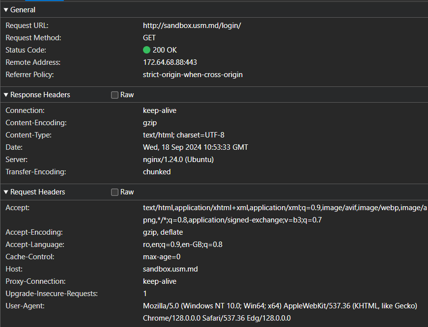
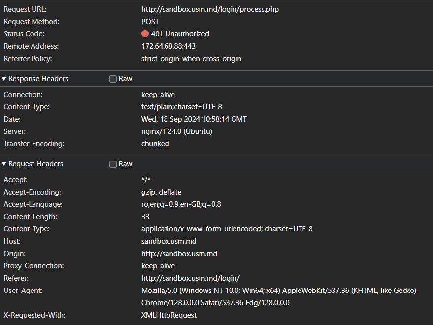
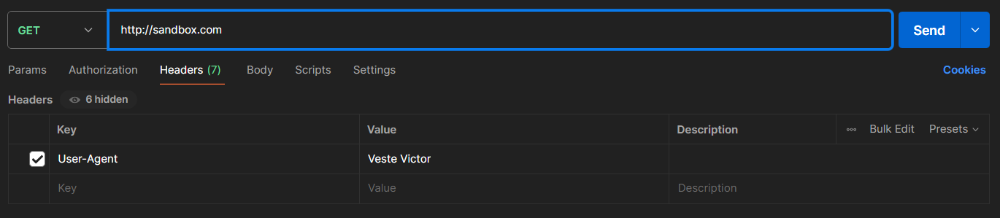
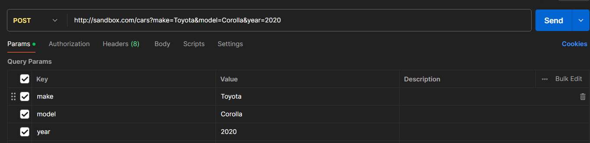
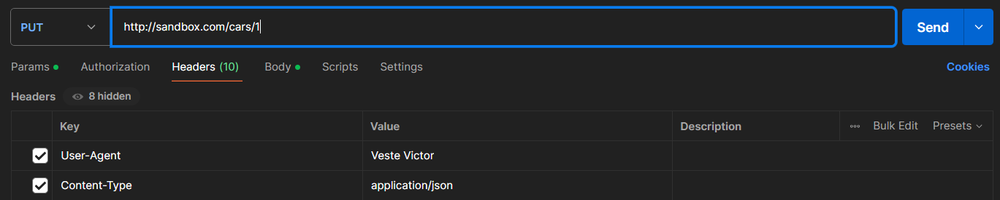
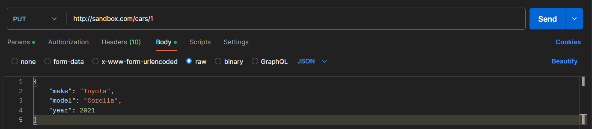
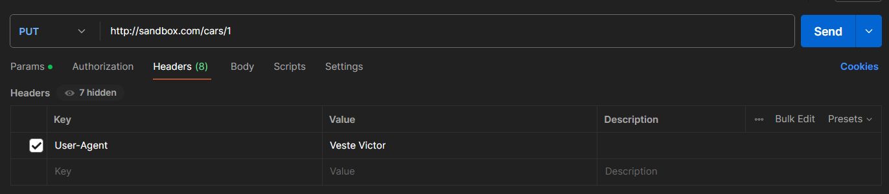

# Lab1

## Sarcina nr.1
Instructiuni pentru rularea lucrarii de laborator

1. Deschideti un browser si accesati site-ul: http://sandbox.usm.md/login.
2. Deschideti instrumentele pentru dezvoltatori ale browserului, accesati fila "Network".
3. Introduceți date incorecte de autentificare (de exemplu, username: student, password: studentpass).
4. Analizati cererile HTTP trimise de browser catre server.
5. Repetati pasii de la 3 la 4 folosind date corecte (username: admin, password: password).

Descrierea lucrarii de laborator

Aceasta lucrare are scopul de a analiza cererile HTTP trimise de un client (browser) catre un server in procesul de autentificare. Vom observa metodele HTTP utilizate, anteturile și parametrii trimisi, raspunsurile serverului și codurile de stare returnate atat pentru autentificarea esuata, cat si pentru cea reusita.

Documentatie scurta a lucrarii de laborator

Proiectul consta intr-o analiza a cererilor HTTP pentru autentificarea pe un server. S-au folosit instrumentele de dezvoltare ale browserului pentru a intercepta si analiza cererile si răspunsurile trimise de server.

Tehnologii utilizate:
+ Browser WEB
+ Instrumentele pentru dezvoltatori din browser ("Network")
+ Protocol HTTP

Exemple de utilizare a lucrarii de laborator

Exemplu nr.1: Autentificare esuata
+ Date trimise: username: Victor, password: 12345
+ Cererile HTTP
  + 

Exemplu nr.2: Autentificare reusita
+ Date trimise: username: admin, password: password
+ Cererile HTTP
  + )

Raspunsuri la intrebarile de control

1. Care metodă HTTP a fost folositată pentru a trimite cererea?
  + Metoda HTTP folosite pentru expedierea cerer este POST.
2. Ce anteturi au fost trimise în cerere?
  + Accept-Language: ru-RU,ru;q=0.9,en-US;q=0.8,en;q=0.7
  + Content-Type: application/x-www-form-urlencoded; charset=UTF-8
  + User-Agent: Mozilla/5.0 (Windows NT 10.0; Win64; x64) AppleWebKit/537.36 (KHTML, like Gecko) Chrome/128.0.0.0 Safari/537.36 Edg/128.0.0.0
3. Ce parametri au fost trimiși în cerere?
  + username: Victor
  + password: 12345
4. Ce cod de stare a fost returnat de server?
  + 401 Unauthorized
5. Ce anteturi au fost trimise în răspuns?
  + Content-Type: text/plain;charset=UTF-8
  + Date: Mon, 16 Sep 2024 15:45:17 GMT
  + Server: nginx/1.24.0 (Ubuntu)

## Sarcina nr.2

1. Scrieți o cerere de tip GET către server la adresa http://sandbox.com, indicând în antetul User-Agent numele și prenumele dvs.
   + 

2. Scrieți o cerere de tip POST către server la adresa http://sandbox.com/cars, indicând în corpul cererii următorii parametri:
   + make: Toyota
   + model Corolla
   + year 2020
   + 

3. Scrieți o cerere de tip PUT către server la adresa http://sandbox.com/cars/1, indicând în antetul User-Agent numele și prenumele dvs., în antetul Content-Type valoarea application/json, iar în corpul cererii următorii parametri: json { "make": "Toyota", "model": "Corolla", "year": 2021 }
   + 
   + 

4. Scrieți unul dintre posibilele răspunsuri ale serverului la cererea anterioară. http POST /cars HTTP/1.1 Host: sandbox.com Content-Type: application/json User-Agent: John Doe model=Corolla&make=Toyota&year=2020 Presupuneți situațiile în care serverul poate returna codurile de stare HTTP 200, 201, 400, 401, 403, 404, 500.
   + Codul de stare 201 (Created).

5.   Scrieți o cerere de tip DELETE la alegerea dvs. și să explicați de ce, în acest caz, este potrivit să utilizați metoda DELETE.
   + 
